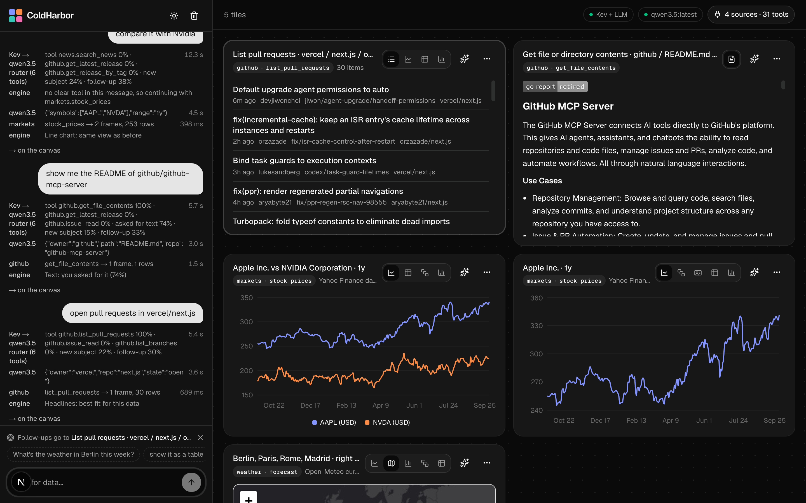
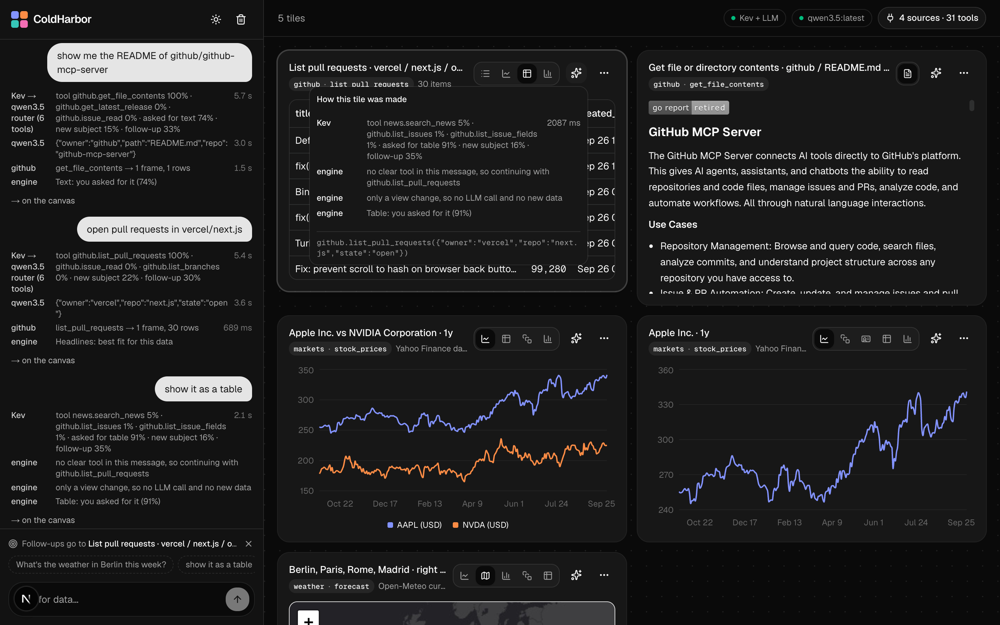

# ColdHarbor

**Connect any MCP server. Ask in plain words. Watch live widgets appear.**



ColdHarbor is a chat-driven dashboard. You plug in data sources (any [MCP](https://modelcontextprotocol.io) server), and when you ask
"weather in Berlin this week" or "compare Apple with Nvidia", it picks the right tool, fills in the arguments, fetches the
data and draws it with the right widget. Follow up with "as a table", "on a map" or "what about Tehran?" and the canvas updates.

Everything runs locally: routing by [Kev](https://github.com/jaredpalmer/kev) (a tiny, calibrated decision model, ~0.2 s),
details by any chat model (Ollama by default), data by MCP servers.

## Goal

Add an MCP server, and you're done. You get a dashboard that shows that server's data as live widgets: charts,
tables, maps, boards, detail cards. You change what you see by asking in plain words.

- **For people who don't write code.** No code, no per-server setup, no mapping work. Add the MCP server and start
  using the dashboard.
- **Works with any MCP server.** Nothing in ColdHarbor is written for one server (GitHub, Linear, a database…).
  Everything is inferred from what servers already expose: tool names, descriptions, input schemas, annotations
  (`readOnlyHint`, `destructiveHint`) and the shape of the data they return.
- **Fast and accurate on small, cheap models.** A "System One" decision model ([Kev](https://github.com/jaredpalmer/kev))
  makes the quick, frequent calls (which tool, which widget, is this a follow-up?) with calibrated confidence in about
  a second. A small local LLM is used only where language is needed (filling in tool arguments) or when Kev is unsure.
  On this repo's benchmark the hybrid router gets 91% of routing right versus 84% for the LLM alone, with a 4.4× faster
  median; see [docs/benchmark.md](docs/benchmark.md).
- **Safe by default.** Tools that only read run on their own. Anything that can change data asks you first.

### Principles

When you build a feature, check it against these:

- **No server-specific code.** If it only works for one MCP server, it doesn't belong in ColdHarbor.
- **Infer, don't configure.** Use what the server already tells us before adding a setting or asking the user.
- **Ask when unsure, never guess silently.** Low confidence becomes a question, not a quiet wrong answer.
- **Read-only runs itself; writes need a click.** Respect tool annotations; when a server gives none, only clearly
  read-only names (`get_…`, `list_…`, `search_…`) run on their own.
- **Small models + System One over one big model.** Fast calibrated decisions first, the LLM only where it's needed.
- **Show why.** Every step the engine takes should be visible to the user.

## Results: before and after

All numbers are from this repo's scripts on one laptop (Apple M4, 16 GB), with a small local LLM (`qwen3.5` via Ollama)
and Kev's smallest model (`kev-0.8b`). The test sets are small; treat a difference of one or two messages as noise.

### A System One model beats an LLM at routing, and is 4× faster

The same engine, sources and widgets. Only who decides "which tool, which view" changes. From [`pnpm bench`](docs/benchmark.md):

| | Before: the LLM decides | After: Kev decides, the LLM only when Kev is unsure |
|---|---|---|
| Tool and view both right | 27/32 (84%) | **29/32 (91%)** |
| Right view (chart, table, map…) | 27/32 | **32/32** |
| Fetched the wrong source with confidence | 0 | 0 |
| Routing time, median | 7.4 s | **1.7 s (4.4× faster)** |
| 9-message conversation | 8/9 right, 102 s, 14 LLM calls | **9/9 right, 60 s, 7 LLM calls** |

The LLM kept inventing view requests nobody made ("how cold will it get in Oslo" → a number card). Follow-ups like
"as a table" skip the LLM and the data call entirely: about 2 s instead of 8.

### Adding a big real-world MCP server, with zero code changes

We connected GitHub's official MCP server (26 tools) next to the 5 built-in ones: 31 tools across 4 servers.
Before: one choice among all 31 tools. After: Kev picks the server, then the tool on that server, and the LLM only
checks Kev's shortlist of 6 when Kev is unsure. From `pnpm eval-router`:

| | Before: one choice among 31 tools | After: server → tool → shortlist |
|---|---|---|
| Right tool | 25/42 | **40/42** |
| GitHub questions | 0/10 | **10/10** |
| Right view | 42/42 | 42/42 |
| Time per message | ~30 s | **4.4 s** |

In every miss before, Kev's first guess was already right; with 31 similar options its confidence was just spread too thin.

### Unfamiliar data, drawn without mapping code

MCP servers return whatever JSON they like. A GitHub commit, as it arrives:

```json
{ "sha": "98b6fd8…", "commit": { "message": "v16.4.0-canary.49\n\n…", "author": { "name": "…", "email": "…", "date": "2026-09-26T20:46:58Z" } },
  "author": { "login": "next-js-bot[bot]", "id": 279046576, "avatar_url": "…" }, "html_url": "https://github.com/…", "node_id": "…" }
```

| Before | After |
|---|---|
| A table with raw JSON in the cells (`commit: {"message":…}`), ids, API links and avatars | **Headlines**: "v16.4.0-canary.49" (first line of the message), author, "2h ago", a link to the commit. The full message stays available. Ids, emails, API links and avatars are dropped. |

The same rules turn a pull request list into headlines, one issue into a detail card with its body rendered, and a
README into formatted text. None of them mention GitHub.

## The idea: three parts that never import each other

```
 Sources                      Frames                      Widgets
 (MCP servers)      ───────►  the one shared   ◄───────   (React + shadcn/ui)
 weather, markets,            data shape                  line, bar, map, table,
 news, GitHub, your DB…                                   cards, headlines, text
                    ▲                                ▲
                    └──────────── Engine ────────────┘
                      Router (Kev or an LLM): which tool? which widget?
                      LLM: fill in the tool's arguments
```

- A **source** is any MCP server. It knows nothing about ColdHarbor's UI. ColdHarbor sources return **Frames** (below);
  other MCP servers work too: their JSON becomes a table, their text becomes a text widget.
- A **widget** is a React component plus a tiny spec: *which frames can I draw?* and *a yes/no question the router
  asks about the message* ("Does the message ask for a map?"). It knows nothing about sources.
- The **engine** routes each message, fills in arguments, calls the tool and picks the widget, reporting every step so
  the UI can show *why*.

### Frames

```ts
interface Frame {
  title: string;
  subtitle?: string;
  fields: { name: string; type: "time" | "number" | "string" | "url" | "lat" | "lon"; unit?: string; label?: string }[];
  rows: Record<string, string | number | null>[];
  prefer?: string[];      // widget ids this frame suits best
  labelField?: string;    // the field that names each row
}
```

A tool can return several frames (e.g. weather returns *the metric over time*, *right now with coordinates*, and *daily details*).
Each widget draws the frame it scores highest, so switching from a chart to a map just picks another frame.

## Quick start

Requirements: Node ≥ 22.18, pnpm, [Ollama](https://ollama.com) with a model (`ollama pull qwen3.5`), and optionally Kev.

```bash
pnpm install
pnpm doctor          # connects to every source, pings the router and the LLM
pnpm dev             # http://localhost:3100
```

Kev (recommended; without it set `"router": { "type": "llm" }`):

```bash
git clone https://github.com/jaredpalmer/kev && cd kev && uv sync --extra serve
uv run --extra serve python -m kev.serve --run jaredpalmer/kev-0.8b --port 8009
```

## Configure: `coldharbor.config.json`

```jsonc
{
  "router": { "type": "hybrid", "baseUrl": "http://127.0.0.1:8009" }, // "hybrid" | "kev" | "llm"
  "llm": { "provider": "ollama", "model": "qwen3.5:latest" },          // or "openai" + baseUrl + apiKey (any compatible API)
  "mcpServers": {                                                     // same format as Claude Desktop
    "weather": { "command": "node", "args": ["sources/weather/src/index.ts"] },
    "github":  { "command": "npx", "args": ["-y", "@modelcontextprotocol/server-github"], "env": { "GITHUB_TOKEN": "${GITHUB_TOKEN}" } },
    "remote":  { "url": "https://example.com/mcp" }
  }
}
```

`${NAME}` is replaced with the environment variable `NAME`, so secrets stay out of the file.

## Add a source

Any MCP server works. To get the best widgets, return Frames. `@coldharbor/source-kit` makes that a few lines:

```ts
import { defineSource, tool, z } from "@coldharbor/source-kit";

defineSource({
  name: "earthquakes",
  tools: {
    recent: tool({
      title: "Earthquakes",
      description: 'Recent earthquakes worldwide. E.g. "earthquakes this week", "big quakes in Japan".',
      input: { minMagnitude: z.number().default(4.5) },
      async run({ minMagnitude }) {
        const j = await (await fetch("https://earthquake.usgs.gov/earthquakes/feed/v1.0/summary/all_week.geojson")).json();
        return {
          title: `Earthquakes ≥ ${minMagnitude} this week`,
          fields: [{ name: "place", type: "string" }, { name: "lat", type: "lat" }, { name: "lon", type: "lon" }, { name: "magnitude", type: "number" }],
          rows: j.features.filter((f: any) => f.properties.mag >= minMagnitude)
            .map((f: any) => ({ place: f.properties.place, lon: f.geometry.coordinates[0], lat: f.geometry.coordinates[1], magnitude: f.properties.mag })),
          labelField: "place",
          prefer: ["map", "table"],
        };
      },
    }),
  },
}).start();
```

Add it to `mcpServers` and restart. It's a normal MCP server, so Claude Desktop, Cursor and others can use it too
(they get a readable text table).

Tips: write the `description` for a router, with a short example of what users ask. Keep inputs few and well described;
the LLM fills them from the user's words.

## Add a widget

1. `apps/web/widgets/<id>/spec.ts`: what it can draw, and the question the router asks.

   ```ts
   export const gauge: WidgetSpec = {
     id: "gauge",
     name: "Gauge",
     ask: "Does the message ask for a gauge or dial?",
     score: (f) => (fieldsOf(f, "number").length && f.rows.length === 1 ? 0.6 : 0),
   };
   ```

2. `apps/web/widgets/<id>/view.tsx`: a React component that takes `{ frame }`. Use anything from `components/ui` (shadcn).
3. Register it in `widgets/specs.ts` and `widgets/views.tsx`.

## Repo layout

```
coldharbor.config.json      what's connected
packages/core           Frame contract, engine, routers (Kev / LLM), LLM adapters, MCP hub. No UI.
packages/source-kit     defineSource(): write a Frame-returning MCP server in a few lines
sources/weather         Open-Meteo            (no key)
sources/markets         Yahoo Finance, CoinGecko, ECB exchange rates (no keys)
sources/news            GDELT, Google News fallback (no key)
apps/web                Next.js + shadcn/ui + motion: chat, canvas, widgets/
scripts/doctor.ts       check config, sources, router, LLM
scripts/eval-router.ts  quick routing accuracy check
scripts/bench.ts        before/after benchmark (LLM vs Kev vs hybrid) → docs/benchmark.md
scripts/cases.ts        the labelled messages both use
```

## Routers, and what Kev buys you

| `router.type` | Who decides tool + widget | Trade-off |
|---|---|---|
| `hybrid` (default) | Kev; the LLM only when Kev is unsure, choosing among Kev's shortlist | Kev's speed on most messages, the LLM's accuracy on the hard ones |
| `kev` | Kev only | Fastest; unsure messages become a "which one?" question |
| `llm` | The LLM for every message | Needs nothing extra; slowest, and it tends to invent view requests |

Measured on this repo's sources, with `pnpm bench`: see **[docs/benchmark.md](docs/benchmark.md)** for accuracy, confidently-wrong answers,
routing time and a full conversation, message by message.

## How a message flows

1. **Route**: Kev answers the widget and follow-up questions and picks a tool. With many tools it first picks the server,
   then the tool on that server. Probabilities are calibrated; the engine acts only when it's sure enough, gets a second
   opinion from the LLM on Kev's shortlist when it isn't, and **asks you** when neither is sure.
2. **Reuse or fetch**: "as a table" is only a view change: no LLM call, no data call. Otherwise the LLM fills in the
   tool's arguments from its JSON Schema, keeping the previous ones for follow-ups, and the MCP tool is called.
3. **Draw**: a widget you asked for, else the same view as before, else the best fit for the frames.

Every step is streamed to the UI and kept on the tile ("Why this?"). Here "show it as a table" was recognised as a
view change, so no LLM call and no new data were needed:



## License

MIT
