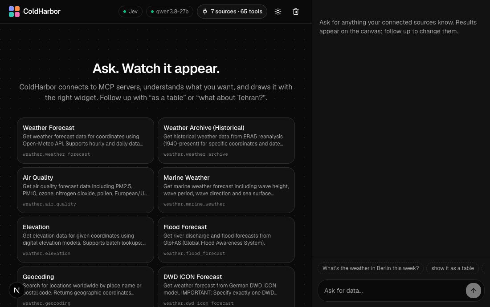

# ColdHarbor

**Connect any MCP server. Ask in plain words. Watch live widgets appear.**



ColdHarbor is a proof of three ideas:

1. **Let a "System One" model make the quick choices, and the LLM only the ones that need language.**
   A decision model ([Jev](https://docs.typesafe.ai/api), hosted, or [Kev](https://github.com/jaredpalmer/kev), 0.8B,
   run it yourself) decides which tool, which view, and whether a message is a follow-up; an LLM fills in arguments, or
   picks from its shortlist when it's unsure. On 38 messages to six third-party MCP servers, compared with the same LLM
   answering the same questions itself: 74% → 95% routed right, 7.8 s → 0.54 s median ([results](#results)).
2. **Answers should be interfaces, not paragraphs.** The UI is inferred from the shape of whatever data an MCP server
   returns (charts, maps, tables, headlines, cards), with no per-server code. Follow-ups like "as a table" re-render
   without calling the LLM.
3. **System One runs the harness, not an agent loop.** There is no plan, act, observe loop. After each message System
   One says what's going on and what comes next: is this a follow-up to the tile on screen, only a view change, about
   the user themself, or nothing to do at all; did the LLM make an argument up; is anything still missing. The engine
   acts on those answers, and the LLM is called once to write the arguments (plus a second opinion or a fix when
   needed). That's what makes a small model enough: in the benchmark's 9-message conversation, 8 LLM calls in all, and
   "show it as a table" takes 0.3 s with none.

In practice it's a chat-driven dashboard. Plug in any [MCP](https://modelcontextprotocol.io) server, and when you ask
"weather in Berlin this week" or "compare bitcoin and ethereum over the last 30 days", it picks the right tool, fills in
the arguments, fetches the data and draws it with the right widget. Follow up with "as a table", "on a map" or "what
about Tehran?" and the canvas updates.


## Goal

Add an MCP server, and you're done. You get a dashboard that shows that server's data as live widgets: charts,
tables, maps, boards, detail cards. You change what you see by asking in plain words.

- **For people who don't write code.** No code, no per-server setup, no mapping work. Add the MCP server and start
  using the dashboard.
- **Works with any MCP server.** Nothing in ColdHarbor is written for one server (GitHub, Linear, a database…).
  Everything is inferred from what servers already expose: tool names, descriptions, input schemas, annotations
  (`readOnlyHint`, `destructiveHint`) and the shape of the data they return.
- **Fast and accurate on small, cheap models.** A "System One" decision model (Jev or Kev) makes the quick, frequent
  calls (which tool, which widget, is this a follow-up?) with calibrated confidence in about half a second. An LLM is
  used only where language is needed (filling in tool arguments) or when System One is unsure. On this repo's
  benchmark that gets 95% of routing right versus 74% for the LLM alone, 14× faster; see [docs/benchmark.md](docs/benchmark.md).
- **Safe by default.** Tools that only read run on their own. Anything that can change data asks you first.

### Principles

When you build a feature, check it against these:

- **No server-specific code.** If it only works for one MCP server, it doesn't belong in ColdHarbor.
- **Infer, don't configure.** Use what the server already tells us before adding a setting or asking the user.
- **Ask when unsure, never guess silently.** Low confidence becomes a question, not a quiet wrong answer.
- **Read-only runs itself; writes need a click.** Respect tool annotations; when a server gives none, only clearly
  read-only names (`get_…`, `list_…`, `search_…`) run on their own.
- **Small models + System One over one big model.** Fast calibrated decisions first, the LLM only where it's needed.
- **No agent loop.** System One decides what happened and what's next; the LLM writes, once.
- **Show why.** Every step the engine takes should be visible to the user.

## Results

From [`pnpm bench`](docs/benchmark.md) on 2026-09-28: six third-party MCP servers (51 tools: Open-Meteo, CoinGecko,
Hacker News, USGS earthquakes, World Bank, arXiv), 38 hand-labelled messages and a 9-message conversation. System One is
Jev; the LLM is `qwen/qwen3.8-27b` on Groq. The test sets are small; treat a difference of one or two messages as noise.
Every earlier run, and what changed between them, is in [docs/benchmarks](docs/benchmarks/README.md).

### System One routes as well as the LLM, 14× faster, and doesn't invent views

The same engine, servers and widgets, and the same questions per message (which server and tool, one per widget, is it
a follow-up…), which the LLM answers in one call. Only who answers changes.

| | The LLM answers | Jev answers | Jev, the LLM when Jev is unsure (default) |
|---|---|---|---|
| Right tool | 37/38 | 35/38 | 36/38 |
| Right view (chart, table, map…) | 29/38 | 38/38 | **38/38** |
| Tool and view both right | 28/38 (74%) | 35/38 (92%) | **36/38 (95%)** |
| Routing time, median | 7.8 s | 0.53 s | **0.54 s (14× faster)** |
| 9-message conversation | 7/9 right, 104 s, 24 LLM calls | 9/9 right, 74 s, 6 LLM calls | **9/9 right, 82 s, 8 LLM calls** |

The LLM picks tools just as well, but keeps inventing views nobody asked for ("tell me a joke" → a text view, "top 10
cryptocurrencies by market cap" → a bar chart), and it sent "what about Tehran?" to the geocoding tool. Jev's two misses
are arguably right: for Oslo and Tokyo it chose the Norwegian and Japanese weather services' own forecasts. Follow-ups
like "show it as a table" skip the LLM and the data call entirely: 0.3 s instead of 12.

### Comparisons from tools that take one thing

"Compare bitcoin and ethereum over the last 30 days": CoinGecko's chart tool takes one coin. The LLM writes a list,
ColdHarbor calls the tool once per coin and draws the series on one time axis, as % change when their price levels
differ. "Compare the GDP of Germany and France since 2000" works the same way with the World Bank server.

### Unfamiliar data, drawn without mapping code

MCP servers return whatever JSON they like. A GitHub commit, as it arrives:

```json
{ "sha": "98b6fd8…", "commit": { "message": "v16.4.0-canary.49\n\n…", "author": { "name": "…", "email": "…", "date": "2026-09-26T20:46:58Z" } },
  "author": { "login": "next-js-bot[bot]", "id": 279046576, "avatar_url": "…" }, "html_url": "https://github.com/…", "node_id": "…" }
```

| Before | After |
|---|---|
| A table with raw JSON in the cells (`commit: {"message":…}`), ids, API links and avatars | **Headlines**: "v16.4.0-canary.49" (first line of the message), author, "2h ago", a link to the commit. The full message stays available. Ids, emails, API links and avatars are dropped. |

The same rules turn a pull request list into headlines, one issue into a detail card with its body rendered, and a
README into formatted text. None of them mention GitHub. Open-Meteo's weather server answers in columns
(`{ time: [...], temperature_2m: [...] }`); they become rows and a line chart. Unix timestamps become dates.

## The idea: three parts that never import each other

```
 Sources                      Frames                      Widgets
 (MCP servers)      ───────►  the one shared   ◄───────   (React + shadcn/ui)
 weather, crypto,             data shape                  line, bar, map, table,
 Hacker News, GitHub, your DB…                            cards, headlines, text
                    ▲                                ▲
                    └──────────── Engine ────────────┘
                      System One (Jev, Kev, or an LLM): which tool? which widget? a follow-up?
                      LLM: fill in the tool's arguments
```

- A **source** is any MCP server. It knows nothing about ColdHarbor's UI. Its JSON is turned into **Frames** (below),
  and its text into a text widget; a server can also return Frames itself.
- A **widget** is a React component plus a tiny spec: *which frames can I draw?* and *a yes/no question System One
  answers about the message* ("Does the message ask for a map?"). It knows nothing about sources.
- The **engine** turns each message into questions for System One, fills in arguments, calls the tool and picks the
  widget, reporting every step so the UI can show *why*.

Every quick decision is a question with a probability and a threshold. Jev, Kev and an LLM implement the same one-method
interface (`decide(message, questions)`), so swapping who answers changes nothing else.

### Frames

```ts
interface Frame {
  title: string;
  subtitle?: string;
  fields: { name: string; type: "time" | "number" | "string" | "text" | "url" | "lat" | "lon"; unit?: string; label?: string }[];
  rows: Record<string, string | number | null>[];
  prefer?: string[];      // widget ids this frame suits best
  labelField?: string;    // the field that names each row
  groupField?: string;    // a field with a few values (status…) to group rows by
}
```

It's a zod schema in [`core/frame.ts`](core/frame.ts), so a source's output is validated, not trusted.

A tool can return several frames (e.g. weather returns *the metric over time*, *right now with coordinates*, and *daily details*).
Each widget draws the frame it scores highest, so switching from a chart to a map just picks another frame.

## Quick start

Requirements: Node ≥ 22.18, pnpm, and two models:

- **System One:** [Jev](https://docs.typesafe.ai/api), hosted by TypeSafe (put `JEV_API_KEY=…` in `.env.local`), or
  [Kev](https://github.com/jaredpalmer/kev), an open 0.8B model you run yourself (below).
- **An LLM:** any OpenAI-compatible API (the default config uses `qwen/qwen3.8-27b` on [Groq](https://groq.com); put
  `GROQ_API_KEY=…` in `.env.local`) or [Ollama](https://ollama.com) on your machine.

ColdHarbor ships no data sources of its own. The default config connects third-party MCP servers, keyless and pinned to
reviewed versions: [Open-Meteo](https://www.npmjs.com/package/open-meteo-mcp-server) (weather),
[CoinGecko](https://www.npmjs.com/package/@cyanheads/coingecko-mcp-server) (crypto; set `COINGECKO_API_KEY` in its `env`
for a higher rate limit), [Hacker News](https://www.npmjs.com/package/mcp-hacker-news),
[USGS earthquakes](https://www.npmjs.com/package/@cyanheads/earthquake-mcp-server), [World Bank](https://www.npmjs.com/package/worldbank-mcp)
and [arXiv](https://www.npmjs.com/package/@cyanheads/arxiv-mcp-server), plus the official GitHub and filesystem servers.

```bash
pnpm install
cp .env.example .env.local   # then add your keys
pnpm probe           # connects to every source, pings System One and the LLM
pnpm dev             # http://127.0.0.1:3100
```

To run Kev yourself instead of Jev, set `"router": { "type": "hybrid" }` (it defaults to Kev on port 8009) and start it:

```bash
git clone https://github.com/jaredpalmer/kev && cd kev && uv sync --extra serve
uv run --extra serve python -m kev.serve --run jaredpalmer/kev-0.8b --port 8009
```

## Configure: `coldharbor.config.json`

```jsonc
{
  // System One: "hybrid" (with the LLM as a second opinion) | "kev" (System One only) | "llm" (the LLM answers everything)
  "router": { "type": "hybrid", "baseUrl": "https://api.typesafe.ai", "model": "jev-latest", "apiKey": "${JEV_API_KEY}" },
  // Any OpenAI-compatible API, or { "provider": "ollama", "model": "qwen3.5:latest" } locally
  "llm": { "provider": "openai", "baseUrl": "https://api.groq.com/openai/v1", "model": "qwen/qwen3.8-27b", "apiKey": "${GROQ_API_KEY}" },
  "mcpServers": {                                                     // same format as Claude Desktop
    "weather": { "command": "npx", "args": ["-y", "open-meteo-mcp-server@2.5.0"] },
    "github":  { "command": "npx", "args": ["-y", "@modelcontextprotocol/server-github"], "env": { "GITHUB_TOKEN": "${GITHUB_TOKEN}" } },
    "remote":  { "url": "https://example.com/mcp" }
  }
}
```

`${NAME}` is replaced with the environment variable `NAME`, so secrets stay out of the file.

## Add an MCP server

Add it to `mcpServers` and restart. Nothing else: its tools, descriptions, schemas and annotations are all ColdHarbor needs.

Writing your own? Return JSON records (a list of objects with names, dates, numbers, links) and the widgets follow. For full
control, return `structuredContent: { frames: Frame[] }` (see [`core/frame.ts`](core/frame.ts)). Write each tool's
`description` for System One, with a short example of what users ask, and keep inputs few and well described: the LLM
fills them from the user's words.

## Add a widget

1. In `widgets/specs.ts`, what it can draw and the question System One answers:

   ```ts
   {
     id: "gauge",
     name: "Gauge",
     ask: "Does the message ask for a gauge or dial?",
     score: (f) => (fieldsOf(f, "number").length && f.rows.length === 1 ? 0.6 : 0),
   },
   ```

2. `widgets/gauge.tsx`: a React component that takes `{ frame }`. Use anything from `components/ui` (shadcn).
3. Add it to `widgets/views.tsx`.

## Repo layout

```
coldharbor.config.json   what's connected
core/                    no React
  frame.ts               the Frame contract (zod) and the widget spec
  systemone.ts           decide(message, questions): Jev or Kev (one API), or any chat model
  route.ts               which tool, which widget, follow-up? (questions + thresholds)
  engine.ts              route → fill → gate → fetch → draw
  fill.ts, hints.ts      tool arguments; who you are and what a server contains
  infer.ts               any JSON or printed text → Frames
  mcp.ts, llm.ts         the MCP hub; the chat model
  canvas.ts, server.ts   the canvas the server owns, and the intents that change it
widgets/                 specs.ts, views.tsx, one file per widget
app/, components/        Next.js + shadcn/ui + motion: chat and canvas
scripts/                 probe (check everything, or one server), bench (→ docs/benchmark.md), cases
```

## Who answers the quick questions

| `router.type` | Who answers | Trade-off |
|---|---|---|
| `hybrid` (default) | System One (Jev or Kev); the LLM chooses from its shortlist when it's unsure which tool is meant | System One's speed on most messages, the LLM's judgment on the hard ones |
| `kev` | System One only (Jev or Kev, whatever `model` says) | Fastest; unsure messages become a "which one?" question |
| `llm` | The LLM, for every question | Needs nothing extra; slowest, and it tends to invent view requests |

Measured with the default servers, with `pnpm bench`: see **[docs/benchmark.md](docs/benchmark.md)** for accuracy, confidently-wrong answers,
routing time and a full conversation, message by message.

## How a message flows

1. **Route**: System One answers the widget and follow-up questions and picks a tool. With many tools it first picks the
   server, then the tool on that server. Probabilities are calibrated; the engine acts only when it's sure enough, gets a
   second opinion from the LLM on System One's shortlist when it isn't, and **asks you** when neither is sure.
   "As a table" is only a view change: no LLM call, no data call.
2. **Fill**: the LLM writes the tool's arguments from its JSON Schema, keeping the previous ones for follow-ups. Values
   nobody said are dropped; required ones still missing are asked for.
3. **Gate**: tools that only read run on their own. Anything else shows you the exact call first.
4. **Fetch**: the MCP tool is called, unless the same call is already on screen. "Compare bitcoin and ethereum" on a tool
   that takes one coin becomes one call per coin, drawn together. Arguments a server rejects get one fix from the LLM.
5. **Draw**: a widget you asked for, else the same view as before, else the best fit for the frames.

The canvas lives on the server (and survives restarts). The browser sends intents that point at things by id, like
"ask this", "run the call you proposed in run 3", or "refresh tile 7"; it can never describe a tool call itself, so another
page can't make ColdHarbor run one. The dev server only listens on 127.0.0.1.

Every step is streamed to the UI and kept on the tile ("Why this?"). Here "show it as a table" was recognised as a
view change, so no LLM call and no new data were needed:


## License

MIT
